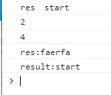
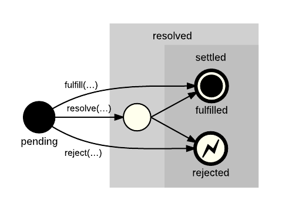
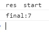
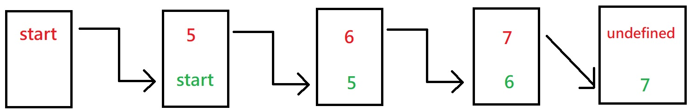
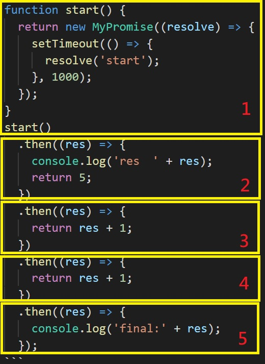
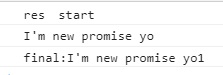

由於 post 頁面的 datamodel 沒有看到參數是能直接塞標題圖片描述的，因此我之後都會將文章標題圖片出處放在參考資料後，基本上都是取自 unsplash。

---

先來看一下最終結果吧，如果使用底下的測試資料

```javascript
function start() {
  return new MyPromise((resolve, reject) => {
    setTimeout(() => {
      resolve('start');
    }, 2000);
  });
}

start()
  .then((res) => {
    console.log('res　' + res);
    return 5;
  })
  .then((res) => {
    console.log('2');
  })
  .then()
  .then((res) => {
    console.log('4');
    return 'faerfa';
  })
  .catch((err) => {
    console.log('err:' + err);
    return 'fwaf';
  })
  .then((res) => {
    console.log('res:' + res);
  });

start().catch((err) => {
  console.log('err:' + err);
  return 5;
});

async function asd() {
  try {
    let result = await start();
    console.log('result:' + result);
  } catch (error) {
    console.log(error);
  }
}
asd();
```

會得到這樣的結果，跟你寫 javascript 時使用 promise 是很相似的：

<div className="Image__Medium">
  
</div>

這個實作我會分成兩篇寫完，一方面是我的腳步可以放慢一點，同時我覺得這種文全部塞在一篇裡，最常見的就是看到一半按下上一頁，這樣子對讀者及作者而言都是損失。

在開始前還是要先做個提醒，本篇可能不適合沒有 es6 promise 使用經驗的人觀看；當然，如果你是因為失眠之類的原因而四處遊蕩，在巧合當中來到這裡，那或許你找對地方了，應該看個幾分鐘，你的眼皮就會大腦達成協議，拉下鐵捲門結束本日營業。

---

如果底下有不太清楚的部分，尤其是名詞，可以試著翻閱[promise/A+規範筆記](https://twilightc.github.io/blog/promise-a-plus-20200707)。

這篇是讓想接觸 promise 實作的人有個概念，因此下方的實作過程並不會全然照著 promise/A+做；如果想直接一窺符合所有規範的 promise 大概長什麼樣子，請參考[簡易 Promise 實作(二)](https://twilightc.github.io/blog/promise-implementation-part-two-20200716)的文末。

我們從一個會印出傳入 data 的函數當作起點，先看一下 thenable ，一個具有 then method 的 object/function 是什麼意思：

```javascript
//getResult is thenable
function getResult() {
  return {
    then: function(cb) {
      cb('call then');
    },
  };
}

getResult().then((res) => {
  console.log(res); //call then
});
```

thenable 其實就是這樣而已，接下來我們開始模擬 promise 的方式來改寫它。

一個 promise 必須要提供 then 這個方法，所以我們寫下：

```javascript
class MyPromise {
  constructor(cb) {
    this.callback = null;
    const resolve = (newValue) => {
      this.callback(newValue);
    };
    cb(resolve);
  }

  then(fn) {
    this.callback = fn;
  }
}

function start() {
  return new MyPromise((resolve) => {
    resolve('start');
  });
}
start().then((res) => {
  console.log(res);
});
```

建立一個 function，在當中使用我們建立的 promise 後，將想要後續才執行的 value 放入 resolve，在使用 then 方法後，才將剛才放入的 value 印出。

但是 resolve 會在 then 之前就執行導致錯誤，所以必須要讓 callback 在接收到要做什麼事情後，才去執行拿到的 value，這邊用 setTimeout 改寫：

```javascript
const resolve = (newValue) => {
  setTimeout(() => {
    this.callback(newValue);
  }, 0);
};
```

你可能會好奇，如果 then 也是非同步的狀況下，問題是不是又出現了？

沒錯，這樣子 resolve 仍然會在 then 之前就執行，所以這邊開始要引入學習 promise 時，最常聽到的 pending、fulfilled、rejected 等狀態，參照下圖。

作為初始態的 pending 最後會變為 fulfilled 或者 rejected，狀態之間有轉移的動作存在且狀態有限(三種)，也因此有人稱之為有限狀態機。

<div className="Image__Medium">
  
</div>

我們在這邊對上面的 class 做幾件事情：

1. 加入能儲存呼叫 resolve 時傳入的 value。

2. 補上狀態，確保 then 一定在 promise 被 resolve 後才執行。

```javascript
class MyPromise {
  constructor(cb) {
    this.state = 'pending';
    this.value = null;
    this.callback = null;
    const resolve = (newValue) => {
      this.state = 'fulfilled';
      this.value = newValue;
      if (this.callback) {
        this.callback(this.value);
      }
    };
    cb(resolve);
  }

  then(onFulfilled) {
    if (this.state === 'pending') {
      this.callback = onFulfilled;
      return;
    }
    onFulfilled(this.value);
  }
}

let getResult = new MyPromise(function(resolve) {
  setTimeout(function() {
    resolve('start');
  }, 500);
});

getResult.then((res) => {
  console.log('first: ' + res);
});

getResult.then((res) => {
  console.log('yee: ' + res);
});

setTimeout(() => {
  getResult.then((res) => {
    console.log('second: ' + res);
  });
}, 1000);

setTimeout(() => {
  getResult.then((res) => {
    console.log('last: ' + res);
  });
}, 1500);
```

這邊建立 promise 測資的方式調整成這樣。執行時可以發現，在還沒 resolve 前，只會印出**yee start**，因為 callback 只有一個，印出 first start 的 function 會被印出 yee start 的 function 給覆蓋掉，因此後續的實作上，我們必須要把這個 callback 改成陣列，儲存所有要 resolve 的 value。

如果還維持

```javascript
function start() {
  return new MyPromise((resolve) => {
    setTimeout(() => {
      resolve('start');
    }, 500);
  });
}
```

的方式進行測試，由於每個 start()都是一個新的 MyPromise，就發現不到這點了。

接著，將 MyPromise 調整成能夠一個接一個呼叫 then，要做到這點，必須先把 then 調整成回傳一個全新的 promise。

```javascript
class MyPromise {
  constructor(cb) {
    this.state = 'pending';
    this.value = null;
    this.resolveHandler = [];
    const resolve = (newValue) => {
      this.state = 'fulfilled';
      this.value = newValue;
      if (this.resolveHandler.length !== 0) {
        this.resolveHandler.forEach((handler) => {
          handler(this.value);
        });
      }
    };
    cb(resolve);
  }

  then(onFulfilled) {
    return new MyPromise((resolve) => {
      if (this.state === 'pending') {
        this.resolveHandler.push((val) => {
          resolve(onFulfilled(val));
        });
        return;
      }

      resolve(onFulfilled(this.value));
    });
  }
}
```

使用以下測資：

```javascript
function start() {
  return new MyPromise((resolve) => {
    setTimeout(() => {
      resolve('start');
    }, 1000);
  });
}
start()
  .then((res) => {
    console.log('res　' + res);
    return 5;
  })
  .then((res) => {
    return res + 1;
  })
  .then((res) => {
    return res + 1;
  })
  .then((res) => {
    console.log('final:' + res);
  });
```

<div className="Image__Medium">
  
</div>

你會得到上面的結果，最終會傳出 7 這個數值。
這段大概是難關之一了，它是如何運作的？一步一步看完吧。

首先是這段：

```javascript
this.resolveHandler = [];
const resolve = (newValue) => {
  this.state = 'fulfilled';
  this.value = newValue;
  if (this.resolveHandler.length !== 0) {
    this.resolveHandler.forEach((handler) => {
      handler(this.value);
    });
  }
};
```

我們把只能存放一個 resolver 的 callback 改成陣列形式的 resolveHandler，之後在 resolve 時，將先前放入的 resolver(程式碼是 handler)以當時的 value 去執行。

先前是哪裡？就是呼叫 then 當下傳入的函數，所以我們看到 then 的部分：

```javascript
then(onFulfilled) {
  return new MyPromise((resolve) => {
    if (this.state === 'pending') {
      this.resolveHandler.push((val) => {
        resolve(onFulfilled(val));
      });
      return;
    }

    let temp = onFulfilled(this.value);
    resolve(temp);
  });
}
```

先把`if (this.state === 'pending')`的部分遮起來，其實剩下的部分跟前一個段落(補上狀態及 this.value 時的 MyPromise class)　 onFulfilled 的部份長的差不多，那為什麼要變成這種形式？我們看張圖吧。

<div className="Image__Medium">
  
</div>

待會提到的 pending 部分也是一樣的道理，首先 start()當中回傳的新 promise， <span style="color:#008000" >`resolve('start')`</span> 將狀態轉變，並且儲存初始 value ，紅字 start 給<span style="color:#008000" >`this.value`</span>後，下一次呼叫 then，時，首先就會把上一次的<span style="color:#008000" >`this.value`</span>傳入函式執行(綠字 start)，得到該函式的回傳值(紅字 5 )，接著再次儲存狀態與數值；重複這個循環直到該 promise 沒有再被呼叫 then 為止。

為什麼上一段是提到狀態，而非明確指出是 fulfilled 或者 rejected？想像一下，如果是回傳一個全新的 promise ，又或者是 then 當中函數執行時出了什麼問題導致 error，你就無法保證下一個 then 接到的到底是 fulfilled 還是 rejected，所以這邊只用狀態稱呼。

到這邊就講完立即執行的狀況了，回頭看 pending 的部分，它做的事情就是：**把一個未來可能會執行的函式放入陣列等待呼叫**，傳入的參數 val 就是未來執行時，在<span style="color:#008000" >`handler(this.value)`</span>帶入的<span style="color:#008000" >`this.value`</span>。

所以非同步的邏輯就是，假設 start()當中回傳的 promise 狀態最後會變成 fulfilled，在狀態轉變之前，必須將所有 then 當中傳入的函式儲存(resolvehandler)，等到 resolve 執行時，再依序執行函數。

把這段程式的執行順序用圖片表示：

<div className="Image__Medium">
  
</div>

你還好嗎？如果覺得理解困難的話去喝水思考一下吧，適度休息，並且再次分析，應該會對理解整個 promise 的概念會有更好的幫助。

---

再來把之前沒補上的一些限制條件加入，resolve 的部份：

1. 狀態一但不是 pending 就不能轉變狀態。
2. promise 不能 resolve 自己。
3. 確認傳入的 newValue 是一個 promise，也就是具有<span style="color:#008000" >`then`</span>函數。

因此，<span style="color:#008000" >`resolve`</span>函數會變成：

```javascript
const resolve = (newValue) => {
  if (this.state !== 'pending') {
    return;
  }
  if (newValue === this) {
    throw new TypeError('cannot resolve itself.');
  }
  if (newValue instanceof MyPromise) {
    newValue.then(resolve);
    return;
  }
  this.state = 'fulfilled';
  this.value = newValue;
  if (this.resolveHandler.length !== 0) {
    this.resolveHandler.forEach((handler) => {
      handler(this.value);
    });
  }
};
```

對第三點解釋一下，它確認傳入的 newValue 是否為 thenable，之後直接使用 newValue 的 then()，**也就是當 then 回傳一個新的 promise (假設這個新 promise 又回傳另一個新的 promise)時，這個條件會遞迴地呼叫 newValue 當中的 then()，直到 newValue 不再是 promise 為止**。

再來是 then 的部分，這邊的限制條件是：

1. 我們之後會把<span style="color:#008000" >`this.state='rejected'`</span>的部分也放入，需要補上對 this.state 的判斷。
2. 判斷傳入的 onFulfilled 是否為 function

   1.1. 若是，把一個會 resolve 當下 onfulfilled 函數的 function 存入 resolvehandler。

   1.2. 若非，直接將 resolve 存入 resolvehanlder。

3. 在狀態為 fulfilled 時，若 onFulfilled 為函數，並且執行時出現錯誤，根據錯誤來 reject 這個 promise。

```javascript
then(onFulfilled) {
  return new MyPromise((resolve) => {
    if (this.state === 'pending') {
      if (typeof onFulfilled === 'function') {
        this.resolveHandler.push((val) => {
          resolve(onFulfilled(val));
        });
      } else {
        this.resolveHandler.push(resolve);
      }

      return;
    }

    if (this.state === 'fulfilled') {
      if (typeof onFulfilled === 'function') {
        try {
          resolve(onFulfilled(this.value));
        } catch (error) {
          // reject(error)
        }
      } else {
        resolve(this.value);
      }
    }
  });
}
```

第二點就是規範(onFulfilled 若非函數則忽略 value)，如果不清楚的話可以看我筆記的第三點。

第三點的話，由於 onFulfilled 可能是外部傳入，我們沒有辦法知道外部程式碼是否正確無誤，因此需要做一個保護；換句話說，**這處理了 callback 的 IOC(inversion of control)導致的 trust issue**；因為我們還沒做 reject 的部份，所以先用註解意思意思一下。

你或許還有疑問，根據第三點，我們需要用 try catch 來預防 onFulfilled 拋出例外，那麽 pending 時，放入 resolveHndler 的 onFulfilled 就不用這樣做嗎？

其實是要的，不過為了好理解，所以暫時只加上為 fulfilled 時的 try catch，下一篇我們會把 pending 的部分也補齊。

到這一步，你已經可以使用以下測資：

```javascript
function start() {
  return new MyPromise((resolve) => {
    setTimeout(() => {
      resolve('start');
    }, 1000);
  });
}
start()
  .then((res) => {
    console.log('res　' + res);
    return 5;
  })
  .then()
  .then((res) => {
    return new MyPromise((resolve) => {
      resolve("I'm new promise yo");
    });
  })
  .then((res) => {
    return res + 1;
  })
  .then((res) => {
    console.log('final:' + res);
  });
```

並且得到以下結果，看起來是不是很棒？

<div className="Image__Medium">
  
</div>

下一篇，我們會把 catch 的部分，以及其它的限制條件及測試相關補上；如果有疑問的話可以在留言區詢問。

---

碎碎念一下，markdown 在這個 template 上產生的效果跟我預想中的差很多，金價麻煩(攤手

### 參考資料:

[[JavaScript] Promise 實作原理](http://jeno5980515.github.io/2017/04/24/Programming%20Language/JavaScript/Promise%E5%AF%A6%E4%BD%9C%E5%8E%9F%E7%90%86/)

[JavaScript Promises ... In Wicked Detail](https://www.mattgreer.org/articles/promises-in-wicked-detail/)

[史上最易讀懂的 Promise/A+完全實現](https://zhuanlan.zhihu.com/p/21834559)

### 使用圖片:

title image:&emsp;[photo by Emile Perron on unsplash](https://unsplash.com/photos/xrVDYZRGdw4)

state transition:&emsp;[What is the correct terminology for javascript promises](https://stackoverflow.com/questions/29268569/what-is-the-correct-terminology-for-javascript-promises)
