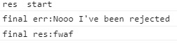
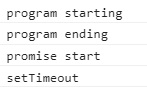

本篇是接續上一篇[簡易 Promise 實作(一)](https://twilightc.github.io/blog/promise-implementation-part-one-20200711)，將文末提及的功能補完。

開始觀看前需要注意，本篇會稍微提到 event loop 相關的名詞；因為要聚焦在實作 promise 上，這裡暫時不會深入解釋其原由；另外就是沉住氣，暫時壓抑你那想按下上一頁的衝動吧。

---

首先，我們把 reject 的程式片段補上，建立的概念與 resolve 大致相同，但有些地方需要調整，這邊我直接放上結果：

```javascript
class MyPromise {
  constructor(cb) {
    this.state = 'pending';
    this.value = null;
    this.resolveHandler = [];
    this.rejectHandler = [];
    const resolve = (newValue) => {
      //upper resolve part...
      if (newValue instanceof MyPromise) {
        newValue.then(resolve, reject);
        return;
      }
      //lower resolve part...
    };

    const reject = (reason) => {
      if (this.state !== 'pending') {
        return;
      }
      if (reason === this) {
        throw new TypeError('cannot reject itself.');
      }

      this.state = 'rejected';
      this.value = reason;
      if (this.rejectHandler.length !== 0) {
        this.rejectHandler.forEach((handler) => {
          handler(this.value);
        });
      }
    };

    try {
      cb(resolve, reject);
    } catch (error) {
      reject(error);
    }
  }

  then(onFulfilled, onRejected) {
    return new MyPromise((resolve, reject) => {
      if (this.state === 'pending') {
        if (typeof onFulfilled === 'function') {
          this.resolveHandler.push((val) => {
            try {
              resolve(onFulfilled(val));
            } catch (error) {
              reject(error);
            }
          });
        } else {
          this.resolveHandler.push(resolve);
        }
        if (typeof onRejected === 'function') {
          this.rejectHandler.push((reason) => {
            try {
              resolve(onRejected(reason));
            } catch (error) {
              reject(error);
            }
          });
        } else {
          this.rejectHandler.push(reject);
        }

        return;
      }

      if (this.state === 'fulfilled') {
        //fulfilled part...
      } else if (this.state === 'rejected') {
        if (typeof onRejected === 'function') {
          try {
            resolve(onRejected(this.value));
          } catch (error) {
            reject(error);
          }
        } else {
          reject(this.value);
        }
      }
    });
  }

  catch(onRejected) {
    return this.then(null, onRejected);
  }
}
```

這邊我們先把 pending 的 try catch 部分補上；再來，寫其他部分時比較要注意的是，先前我們在許多地方傳入 callback 時都只傳 resolve，現在你需要同時傳入 resolve，以及 reject；此外，不需要在 catch 當中再寫一次跟 then 同樣的邏輯，呼叫 then 並且只傳入 onRejected 就行。

再來是這段：

```javascript
else if (this.state === 'rejected') {
  if (typeof onRejected === 'function') {
    try {
      resolve(onRejected(this.value));
    } catch (error) {
      reject(error);
    }
  } else {
    reject(this.value);
  }
}
```

我們同樣把 this.value 交給 onRejected 處理，之後傳入 resolve 中取得數值與狀態之後往下傳，可能有人會有疑問，那我可以把 reject function 加入：

```javascript
if (reason instanceof MyPromise) {
  reason.catch(resolve, reject);
  return;
}
```

再把 <span style="color:#008000" >`resolve(onRejected(this.value))`</span>變 <span style="color:#008000" >`reject(onRejected(this.value))`</span>嗎？

你可以拿下面那個測資試試看，結果是對的。但是沒有必要，原因有幾個：

1. 在這個判斷底下，<span style="color:#008000" >`reject("Nooo I've been rejected")`</span>對應的 new MyPromise()，當中 onRejected 最後會得到一個 undefined 值，導致無論用 resolve 或者是 reject 都無所謂，因為這個數值沒有意義，最後也不會被後面取用。
2. 如果我們在 catch 裡回傳 resolve，拿 reject 去處理，這個操作邏輯上不合理。

綜合上面，我們只在 resolve 裡面寫下判斷，並且統一取用 resolve 即可。

ok，我們將上一筆測資進行變化並重新測試：

```javascript
function start() {
  return new MyPromise((resolve, reject) => {
    setTimeout(() => {
      resolve('start');
    }, 1000);
  });
}
start()
  .then((res) => {
    console.log('res　' + res);
    return 5;
  })
  .then()
  .then((res) => {
    return new MyPromise((resolve, reject) => {
      reject("Nooo I've been rejected");
    });
  })
  .then()
  .catch()
  .catch((err) => {
    console.log('final err:' + err);
    return 'fwaf';
  })
  .then((res) => {
    console.log('final res:' + res);
  });
```

你會得到以下的結果，

<div className="Image__Medium">
  
</div>

好，到這邊你擊倒了 then 跟 catch 兩頭猛虎，並且還可以將他們串起來做各種操作，接下來就是做測試，然後宣告你的手工 promise 正式出爐，對吧？

當然不是，不然我就不會這樣問了。

執行這段測資，你就知道我們的 promise 沒有加入非同步的動作。

```javascript
console.log('program starting');

setTimeout(() => {
  console.log('setTimeout');
}, 0);

function start() {
  return new MyPromise((resolve, reject) => {
    resolve('promise start');
  });
}
start().then((res) => {
  console.log(res);
});
console.log('program ending');
```

也因此，我們必須把 resolve、 reject，以及 then 當中的操作轉為非同步的形式，這邊只舉 resolve 作為例子，reject 要補上的部分完全相同。

```javascript
//resolve part
if (this.resolveHandler.length !== 0) {
  this.resolveHandler.forEach((handler) => {
    setTimeout(() => {
      handler(this.value);
    }, 0);
  });
}
//then part after this.state turn into 'fulfilled'
if (this.state === 'fulfilled') {
  setTimeout(() => {
    if (typeof onFulfilled === 'function') {
      try {
        resolve(onFulfilled(this.value));
      } catch (error) {
        reject(error);
      }
    } else {
      resolve(this.value);
    }
  }, 0);
}
```

哦，看起來我加個 setTimeout 就行，這次真的可以開心收工了吧？

**抱歉，得請你再忍一會...**，至於原因，請你看一下 MyPromise 使用上面測資產生的執行結果：

<div className="Image__Medium">
  
</div>

再看看你平常使用的 promise 產生的結果：

<div className="Image__Medium">
  
</div>

WTF，為什麼我們做的 promise 執行順序跟 es6 的 promise 在非同步執行上出現了差異？

因為 setTimeout 是一個 macrotask(task)，如果你的 promise 內部也使用 setTimeout 實現，意味著它們會被按照推入 task queue 的順序執行，自然就造成你的執行結果跟原生 promise 出現差異了。

如果要解決這個問題，你必須將 MyPromise 作為 microtask 推入 microtask queue 當中，確保這個 microtask 會先於 macrotask 前被執行。

nodejs 環境下可選的有 process.nextTick，而前端則可選擇[queueMicrotask](https://developer.mozilla.org/en-US/docs/Web/API/WindowOrWorkerGlobalScope/queueMicrotask)。

因此我們要再度改寫上面的非同步動作，並在開頭依執行環境決定應呼叫哪個 api 。

```javascript
//top of the code
let queueMicrotask = this.queueMicrotask || process.nextTick;

class MyPromise {
  constructor(cb) {
    //setting...
    const resolve = (newValue) => {
      //resolve part...
      if (this.resolveHandler.length !== 0) {
        this.resolveHandler.forEach((handler) => {
          queueMicrotask(() => handler(this.value));
        });
      }
    };

    const reject = (reason) => {
      //reject part...
      if (this.rejectHandler.length !== 0) {
        this.rejectHandler.forEach((handler) => {
          queueMicrotask(() => handler(this.value));
        });
      }
    };
    //operate...
  }

  then(onFulfilled, onRejected) {
    return new MyPromise((resolve, reject) => {
      //determine how to process onFuillfed/onRejected...
      if (this.state === 'fulfilled') {
        queueMicrotask(() => {
          if (typeof onFulfilled === 'function') {
            try {
              resolve(onFulfilled(this.value));
            } catch (error) {
              reject(error);
            }
          } else {
            resolve(this.value);
          }
        });
      } else if (this.state === 'rejected') {
        queueMicrotask(() => {
          if (typeof onRejected === 'function') {
            try {
              resolve(onRejected(this.value));
            } catch (error) {
              reject(error);
            }
          } else {
            reject(this.value);
          }
        });
      }
    });
  }
  //catch part...
}
```

本次的 promise 也差不多到這邊結束，因此我把完整的程式碼放上來，如果你有從頭到尾跟著動手改，但不知道哪裡出了問題，可以直接參考[這個 gist](https://gist.github.com/twilightc/822f98a9df256618201644ff175017f0)

到這裡為止，除了上述 promise 測試資料，你還可以做到像是：

```javascript
function start() {
  return new myPromise((resolve, reject) => {
    setTimeout(() => {
      resolve('start');
    }, 2000);
  });
}

start()
  .then((res) => {
    console.log('res　' + res);
    return 5;
  })
  .then()
  .then((res) => {
    console.log(res);
    return new myPromise((resolve) => {
      setTimeout(() => {
        resolve("I'm new promise yo");
      }, 3000);
    });
  })
  .then((res) => {
    console.log(res);
    return '4res';
  })
  .catch((err) => {
    console.log('err:' + err);
    return 'an error';
  })
  .then((res) => {
    console.log('res:' + res);
  });

start().catch((err) => {
  console.log('err:' + err);
  return 5;
});

async function asd() {
  try {
    let result = await start();
    console.log('result:' + result);
  } catch (error) {
    console.log(error);
  }
}
asd();
```

像這樣子，是不是跟我們平常使用 async/await 時一模一樣？

---

如果你堅持到這，恭喜你學得了從無到有弄出一個 promise 的概念。

概念？所以到目前為止做的都不算是真正的 promise 嗎？

不算。記得我在第一篇提到的嗎？為了能夠更好的理解 promise 機制，我們沒全然照著規範做；接下來會讓你知道，如何測試寫好的 promise 是否符合規範，以及通過規範的 promise 長得像什麼樣子。

你在看著這幾篇文章實作 promise 時，應該多少會查點資料，當中可能有個叫做 Promises-aplus-tests 的套件，是讓你用來測試你所寫的 promise 是否符合 promse/A+規範。

要進行測試，你首先要安裝這個套件，在 cmd 中輸入：

&emsp;&emsp;<span style="color:#008000" >`npm install promises-aplus-tests -g`</span>

在檔案最下方補上這段程式碼

```javascript
MyPromise.deferred = () => {
  let dfd = {};
  dfd.promise = new MyPromise((resolve, reject) => {
    dfd.resolve = resolve;
    dfd.reject = reject;
  });
  return dfd;
};

module.exports = MyPromise;
```

最後在 cmd 輸入：<span style="color:#008000" >`promises-aplus-tests 檔案名稱.js`</span>，就會對你寫的 promise 進行測試。

然後看到 MyPromise 噴了幾百個錯誤...但不用著急，我們這就附上一個[可以通過測試的完整 promise code](https://gist.github.com/twilightc/be278ea4b610252e214a30a7b541d0a6)，你可以觀察一下跟我們剛剛做的 MyPromise 差在哪。

基本上，最大的差異就是那個 resolveProcedure(對應規範 2.3 節)，完整實作這點規範，我們才能確保不同人做的 promise 可以互用；等等，promise 有多到需要確保可以互相使用嗎？

有的，雖然我們現在用的大多都是 2015 年，es6 訂定的 native promise，但其實還有像是 jquery 的 deferred object 跟 angularjs 的 \$q 之類，在 es6 誕生前就出現的 promiselike object，若你哪天被迫交互使用這些玩意時，確保可以互用這點就幫大忙了－－大概啦。

謝謝你看完這篇長文，如果有什麼困難或問題可以留言告訴我。

### 參考資料:　

[史上最易讀懂的 Promise/A+完全實現](https://zhuanlan.zhihu.com/p/21834559)

[Promise 實現，一條規範對應一段代碼](https://juejin.im/post/5d306e0951882540be3a29cd#heading-39)

[Promise/A+ specification](https://promisesaplus.com/#notes)

### 使用圖片:

title image:&emsp;[Photo by 🇨🇭 Claudio Schwarz | @purzlbaum on Unsplash](https://unsplash.com/photos/i25aqE_YUZs)
